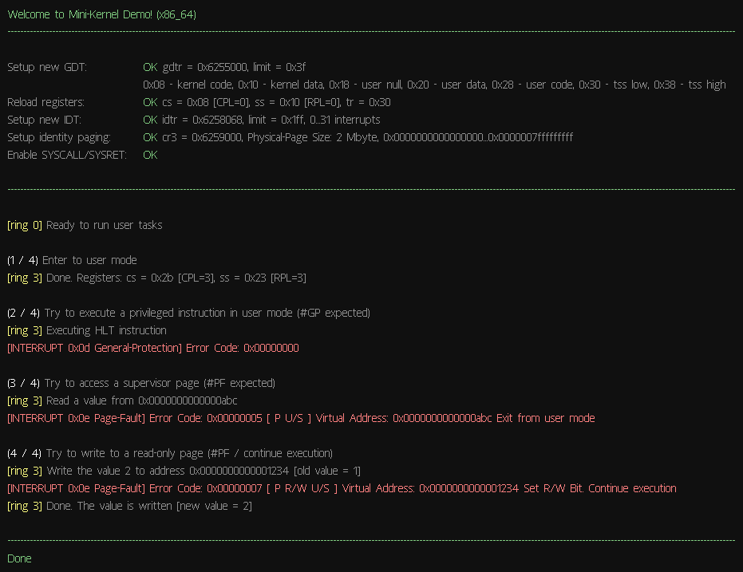

Mini-Kernel
===========

This is a simple demonstration of entering user mode and going back to the kernel on an x86_64 architecture.

Contains the following cases:
* Entering user mode
* Execution of a privileged instruction (General-Protection exception)
* Accessing a supervised page (Page-Fault exception)
* Writing to a read-only page (Page-Fault exception)

## Prerequisites

* [Visual Studio 2022](https://developer.microsoft.com/en-us/windows/downloads)
* [QEMU](http://www.qemu.org)
* A git client to initialize and update submodules

## Building

Initialize the git submodule:
```
git submodule update --init
```

Open mini-kernel.sln in Visual Studio. 

Press `F5` to compile and run the application in the QEMU emulator.

## Screenshot


## License
[GPLv2](https://choosealicense.com/licenses/gpl-2.0/)


